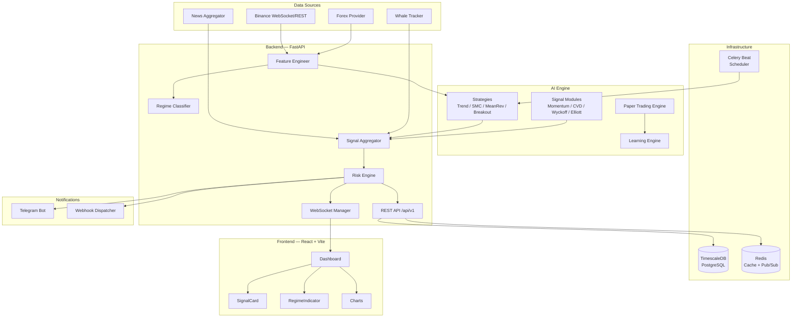
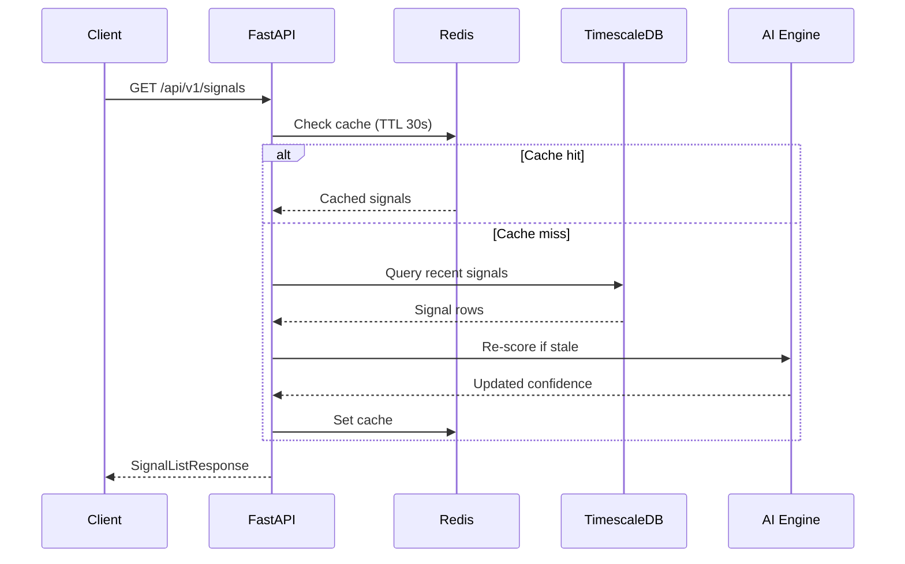
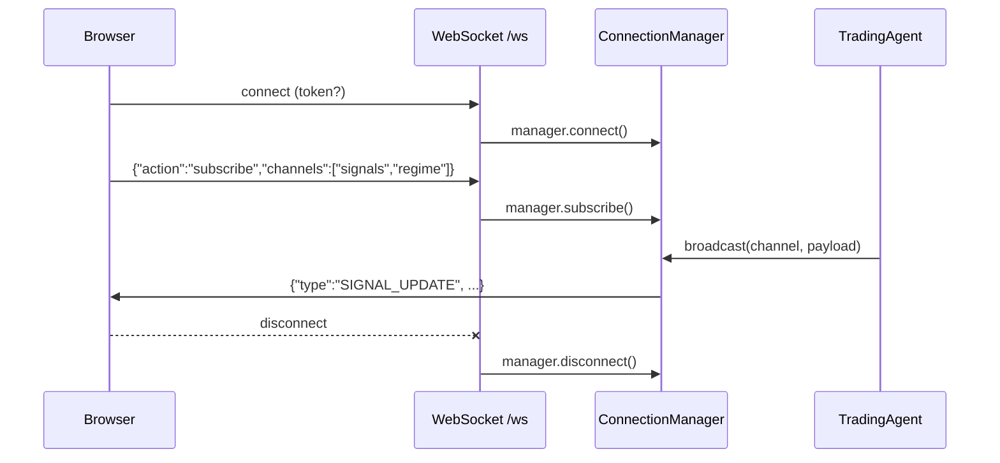
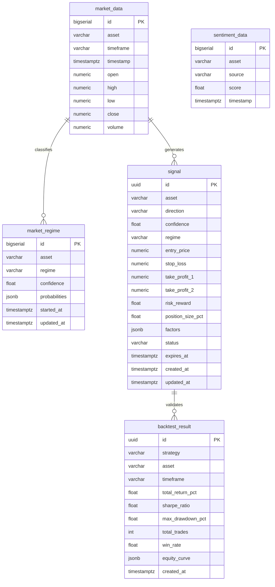

# AI Trading Navigator

> AI-powered crypto & forex market analysis system — regime classification, signal generation, and real-time dashboard. **Not an autotrading system** — a human always makes the final decision.

---

## Table of Contents

- [Overview](#overview)
- [Architecture](#architecture)
- [Tech Stack](#tech-stack)
- [Project Structure](#project-structure)
- [Getting Started](#getting-started)
- [Environment Variables](#environment-variables)
- [API Reference](#api-reference)
- [AI Engine](#ai-engine)
- [Database Schema](#database-schema)
- [Testing](#testing)
- [CI/CD](#cicd)
- [Contributing](#contributing)

---

## Overview

AI Trading Navigator classifies market regimes, generates trading signals with explainable reasoning, and delivers them to a React dashboard and Telegram. It is a **decision-support tool**, not an execution engine.

### Core Capabilities

| Feature | Description |
|---|---|
| Market Regime Classification | Rule-based + LightGBM (TREND_BULL / TREND_BEAR / CONSOLIDATION / HIGH_VOL_CHOPPY) |
| Signal Generation | Multi-strategy aggregation with confidence scoring |
| Risk Engine | Kelly Criterion, drawdown waterfall, correlation cap, daily loss limit |
| Paper Trading | Full simulation engine with performance tracking |
| Real-time Dashboard | 100+ React panels over WebSocket |
| Notifications | Telegram bot + webhook dispatcher |
| Backtesting | Walk-forward + A/B strategy testing |

---

## Architecture



### Request Lifecycle



### WebSocket Flow



---

## Tech Stack

### Backend

| Layer | Technology |
|---|---|
| API Framework | FastAPI 0.115+ (async/await) |
| Runtime | Python 3.12 |
| Database | TimescaleDB (PostgreSQL 16) via asyncpg + SQLAlchemy 2 |
| Cache / Pub-Sub | Redis 7 |
| Task Queue | Celery 5 + Celery Beat |
| Migrations | Alembic |
| ML / AI | LightGBM, scikit-learn, PyTorch, HuggingFace Transformers |
| Technical Indicators | ta library (pandas-ta compatible) |
| Auth | PyJWT |
| Observability | OpenTelemetry, structured JSON logging |
| Notifications | python-telegram-bot, httpx webhooks |

### Frontend

| Layer | Technology |
|---|---|
| Framework | React 18 + Vite 5 |
| Language | TypeScript 5.6 (strict) |
| State | Zustand 5 (persist middleware) |
| Server State | TanStack React Query v5 |
| Charts | Lightweight Charts 4, Recharts 2 |
| Styling | Tailwind CSS 3 |
| HTTP | Axios |
| Validation | Zod 4 |
| Real-time | Native WebSocket (with reconnect logic) |
| Build Analysis | rollup-plugin-visualizer |
| Bundle Guard | size-limit |

### Infrastructure

| Component | Technology |
|---|---|
| Containerization | Docker + Docker Compose |
| CI/CD | GitHub Actions |
| Performance Budget | Lighthouse CI |
| DB Compression | TimescaleDB columnar compression |

---

## Project Structure

```
trading-platform/
├── backend/
│   ├── app/
│   │   ├── ai/
│   │   │   ├── agent/          # TradingAgent, LearningEngine, DayTrading
│   │   │   ├── analytics/      # Bayesian updater, HMM regime, confidence calibrator
│   │   │   ├── automation/     # Alert engine, champion/challenger, XAI explainer
│   │   │   ├── backtesting/    # Walk-forward, A/B testing
│   │   │   ├── market/         # BTC dominance, Fear & Greed, funding regime
│   │   │   ├── portfolio/      # MPT optimizer
│   │   │   ├── regime/         # RegimeClassifier (rule-based + LightGBM)
│   │   │   ├── reports/        # Daily briefing, morning briefing, signal explainer
│   │   │   ├── risk/           # Kelly, drawdown, correlation cap, vol sizing
│   │   │   ├── signals/        # 40+ signal modules (CVD, Wyckoff, Elliott, etc.)
│   │   │   ├── simulation/     # PaperTradingEngine, PositionManager
│   │   │   └── strategies/     # TrendFollowing, SMC, MeanReversion, VolumeBreakout, …
│   │   ├── api/v1/             # FastAPI routers (signals, market, backtest, …)
│   │   ├── core/               # Config, auth, logging, websocket, telemetry
│   │   ├── data/
│   │   │   ├── fetchers/       # Binance, Forex, News, Whale, OrderFlow, Liquidation
│   │   │   └── processors/     # FeatureEngineer, OHLCV normalizer
│   │   ├── models/             # SQLAlchemy ORM models
│   │   ├── notifications/      # Telegram bot
│   │   └── schemas/            # Pydantic request/response schemas
│   ├── alembic/versions/       # DB migrations
│   ├── tests/                  # pytest test suite
│   └── requirements.txt
├── frontend/
│   └── src/
│       ├── components/
│       │   ├── Dashboard/      # 100+ dashboard panels
│       │   ├── SignalCard/     # Signal card with swipe gestures
│       │   ├── RegimeIndicator/
│       │   ├── RiskPanel/
│       │   ├── hooks/          # Component-local hooks
│       │   └── ui/             # Shared UI primitives (ErrorBoundary, Toast, etc.)
│       ├── contexts/           # WebSocketContext
│       ├── hooks/              # App-wide hooks (useWebSocket, useApi, useAlerts)
│       ├── lib/                # format, errorLogger, signalCache, validation
│       ├── pages/              # Backtest, ProAnalysis, Screener, Settings, TradeHistory
│       ├── store/              # Zustand store
│       └── types/              # TypeScript interfaces (Signal, RegimeData, WSMessage)
├── docs/                       # PRD, Architecture, Data Models, AI Engine spec
├── .github/workflows/ci.yml    # CI/CD pipeline
├── docker-compose.yml
└── .env.example
```

---

## Getting Started

### Prerequisites

- Docker & Docker Compose
- Python 3.12+ (for local backend dev)
- Node.js 20+ (for local frontend dev)

### Quick Start (Docker)

```bash
# Clone the repository
git clone <repo-url>
cd trading-platform

# Copy and configure environment variables
cp .env.example .env
# Edit .env with your API keys

# Start all services
docker compose up -d

# Run database migrations
docker exec trading-backend alembic upgrade head

# Check service health
curl http://localhost:8000/api/v1/health
```

Services will be available at:
- **Frontend**: http://localhost:5173
- **Backend API**: http://localhost:8000
- **API Docs**: http://localhost:8000/docs
- **TimescaleDB**: localhost:5432

### Local Development

```bash
# Backend
cd backend
python -m venv .venv && source .venv/bin/activate
pip install -r requirements.txt
uvicorn app.main:app --reload --port 8000

# Frontend (separate terminal)
cd frontend
npm install
npm run dev
```

---

## Environment Variables

| Variable | Required | Description |
|---|---|---|
| `DATABASE_URL` | Yes | PostgreSQL async URL (`postgresql+asyncpg://...`) |
| `REDIS_URL` | Yes | Redis URL (`redis://...`) |
| `SECRET_KEY` | Yes | JWT signing secret (min 32 chars) |
| `BINANCE_API_KEY` | Yes | Binance REST/WS API key |
| `BINANCE_SECRET` | Yes | Binance API secret |
| `TELEGRAM_BOT_TOKEN` | No | Telegram bot token for notifications |
| `WHALE_ALERT_API_KEY` | No | Whale Alert API key |
| `GLASSNODE_API_KEY` | No | Glassnode on-chain data |
| `ANTHROPIC_API_KEY` | No | Claude API for AI commentary |
| `ADMIN_USERNAME` | Yes | Single-user admin login |
| `ADMIN_PASSWORD` | Yes | Single-user admin password |
| `ENVIRONMENT` | Yes | `development` or `production` |
| `CORS_ORIGINS` | Yes | Allowed origins (comma-separated) |

See `.env.example` for the full reference.

---

## API Reference

### Authentication

```http
POST /api/v1/auth/token
Content-Type: application/json

{ "username": "admin", "password": "..." }

→ { "access_token": "...", "token_type": "bearer" }
```

All subsequent requests use `Authorization: Bearer <token>`.

### Key Endpoints

| Method | Path | Description |
|---|---|---|
| `GET` | `/api/v1/health` | Health check |
| `GET` | `/api/v1/signals` | Paginated signal list |
| `GET` | `/api/v1/market/regime/{asset}` | Current market regime |
| `GET` | `/api/v1/market/ohlcv` | OHLCV candlestick data |
| `POST` | `/api/v1/analyze/run` | Run full AI analysis |
| `POST` | `/api/v1/backtest/run` | Run walk-forward backtest |
| `GET` | `/api/v1/simulation/paper` | Paper trading positions |
| `GET` | `/api/v1/risk/drawdown-budget` | Current drawdown budget |
| `WS` | `/ws?token=...` | Real-time signal/regime stream |

Interactive docs: `http://localhost:8000/docs`

### WebSocket Channels

Subscribe after connecting:

```json
{ "action": "subscribe", "channels": ["signals", "regime", "sentiment", "alerts"] }
```

Message types: `SIGNAL_UPDATE`, `SIGNAL_NEW`, `REGIME_CHANGE`, `ALERT_FIRED`, `DRAWDOWN_UPDATE`

---

## AI Engine

### Market Regime Classification

1. **Rule-based labeling** — ADX, EMA cross, ATR normalization, Bollinger width, OBV trend
2. **LightGBM model** — trained on labeled history, 4-class output (TREND_BULL / TREND_BEAR / CONSOLIDATION / HIGH_VOL_CHOPPY)
3. **HMM Regime** — Hidden Markov Model as secondary confirmation
4. **Fallback** — Pure rule-based when model file is absent (cold start)

### Signal Pipeline

```
OHLCV Data
    → FeatureEngineer (50+ technical features)
    → Strategies (TrendFollowing, SMC, MeanReversion, VolumeBreakout, …)
    → Signal Modules (CVD, Wyckoff, Elliott, Liquidation, OrderFlow, …)
    → SignalAggregator (weighted scoring)
    → RiskEngine (Kelly sizing, drawdown gate, correlation cap)
    → Final Signal {direction, confidence, entry, SL, TP1, TP2, R/R}
```

### Risk Controls

| Control | Description |
|---|---|
| Drawdown Kill Switch | Halts signals when portfolio drawdown > threshold |
| Kelly Criterion | Optimal position sizing based on historical win rate |
| Correlation Cap | Max correlated positions per cluster |
| Daily Loss Limit | Hard stop on daily P&L |
| Streak Circuit Breaker | Pause after N consecutive losses |
| Volatility Adaptive Sizing | Scale size down in high-vol regimes |

---

## Database Schema



---

## Testing

### Backend

```bash
cd backend

# Run all tests
pytest tests/ -v

# Run with coverage
pytest tests/ --cov=app --cov-report=html

# Run specific modules
pytest tests/test_strategies.py -v
pytest tests/test_risk_modules.py -v
pytest tests/test_monte_carlo.py -v
pytest tests/test_websocket.py -v
```

Test categories:
- `test_strategies.py` — AI strategy unit tests (TrendFollowing, SMC, MeanReversion)
- `test_risk_modules.py` — Risk module unit tests (Kelly, CorrelationCap, DailyLossLimit)
- `test_monte_carlo.py` — Deterministic simulation tests (seed-based)
- `test_websocket.py` — WebSocket integration tests
- `test_api.py` — REST API endpoint tests

### Frontend

```bash
cd frontend

# Type check
npx tsc --noEmit

# Lint
npm run lint

# Unit tests (Vitest)
npm test

# Test with coverage
npm run test:coverage

# Bundle size guard
npm run size
```

---

## CI/CD

GitHub Actions runs on every push to `main` and `feature/**` branches.

```
push / PR
    ├── backend job
    │   ├── TimescaleDB + Redis services
    │   ├── pip install
    │   ├── pytest (full suite)
    │   └── validate_backtest.py
    ├── frontend job
    │   ├── npm ci
    │   ├── tsc --noEmit
    │   ├── eslint
    │   ├── npm run build
    │   └── size-limit check
    ├── security job
    │   ├── Trivy vulnerability scan
    │   └── Bandit (Python SAST)
    └── lighthouse job (needs: frontend)
        └── Lighthouse CI (performance budget)
```

### Deployment

Deployments to production use Docker images built in CI:

```bash
# Build images
docker compose build

# Deploy (example with Docker Swarm / Compose on VPS)
docker compose -f docker-compose.yml up -d --remove-orphans
```

---

## Contributing

1. Fork the repository
2. Create a feature branch: `git checkout -b feature/my-feature`
3. Install pre-commit hooks: `cd frontend && npm run prepare`
4. Make changes, write tests
5. Ensure CI passes locally:
   ```bash
   # Backend
   cd backend && pytest tests/ -v
   # Frontend
   cd frontend && npm run lint && npx tsc --noEmit && npm test
   ```
6. Open a Pull Request against `main`

### Commit Convention

Follow [Conventional Commits](https://www.conventionalcommits.org/):

```
feat: add CVD divergence signal
fix: correct Kelly criterion edge case
docs: update API reference
test: add regime classifier unit tests
refactor: extract signal scoring to pure function
```

---

## License

Private — All rights reserved.
