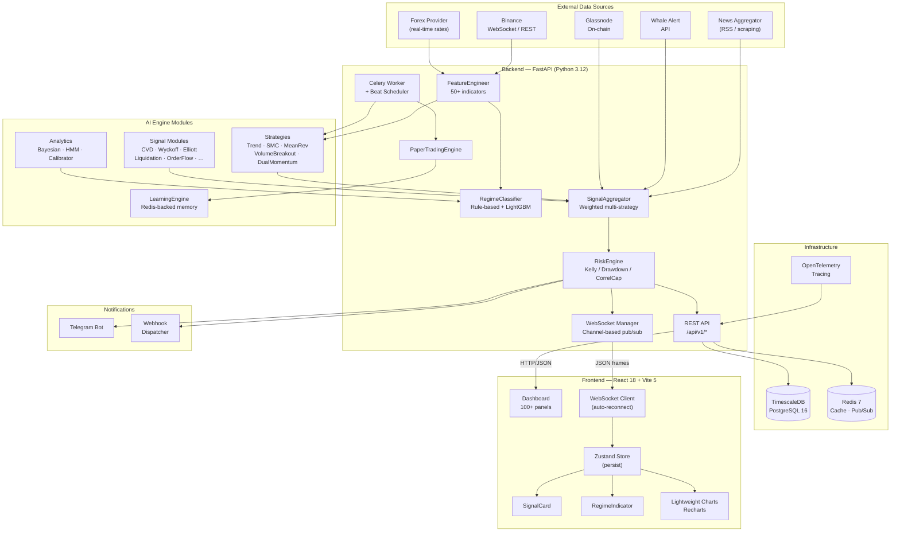
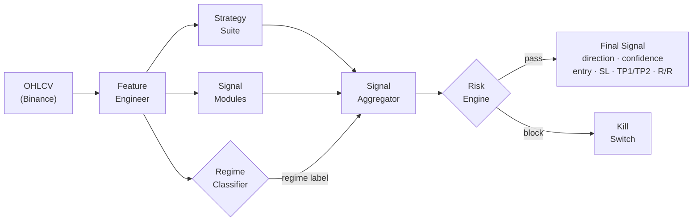
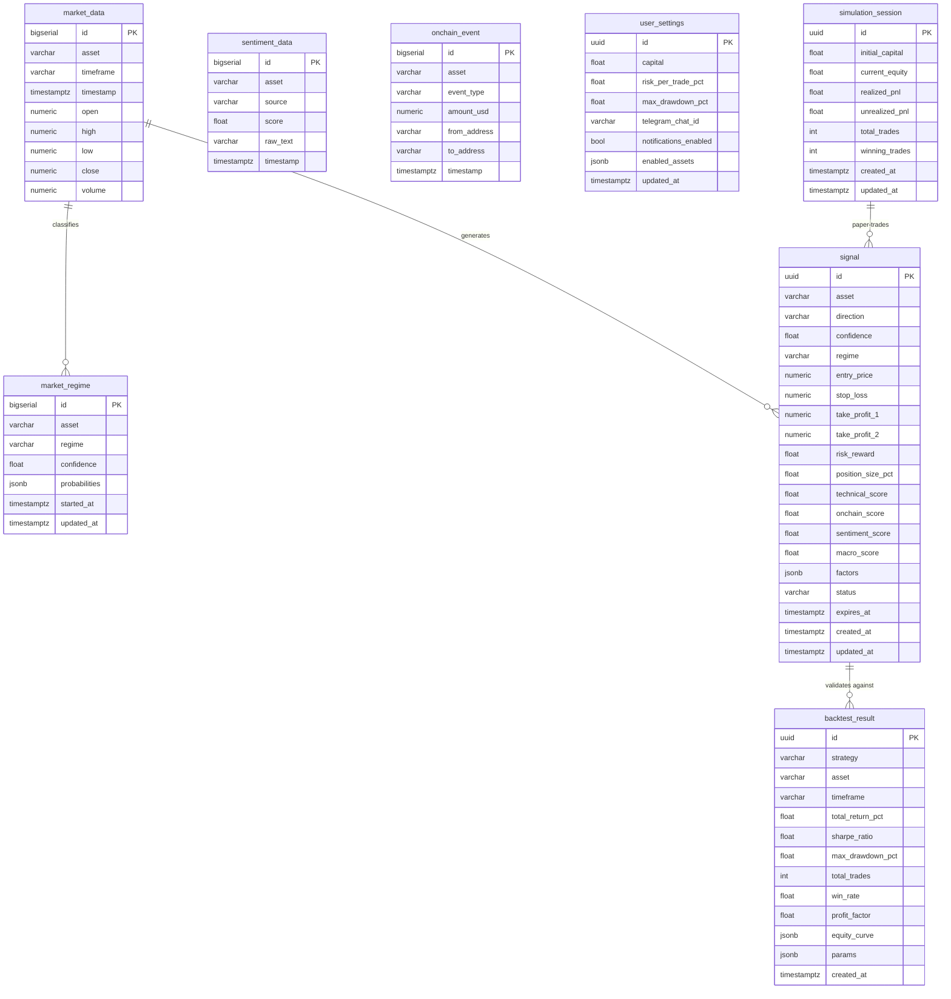
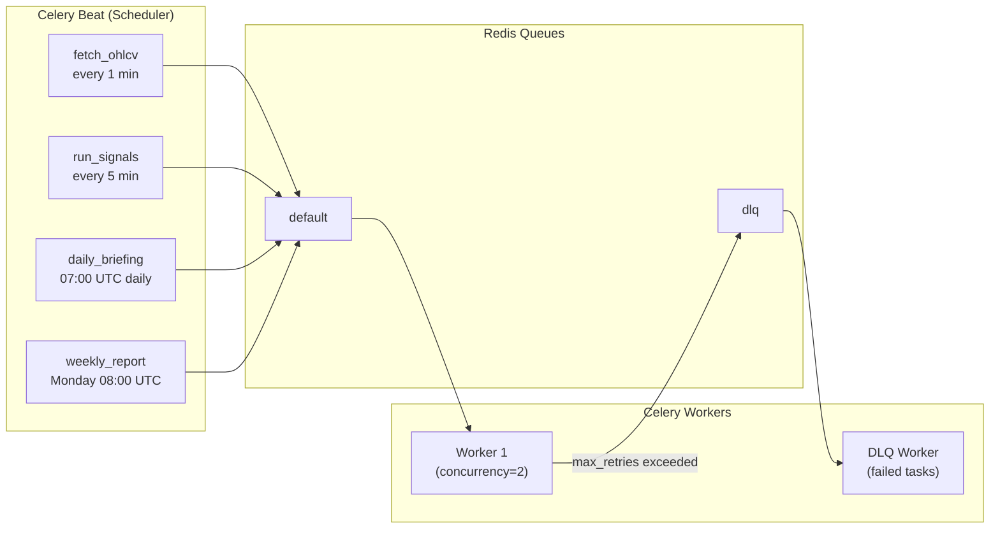
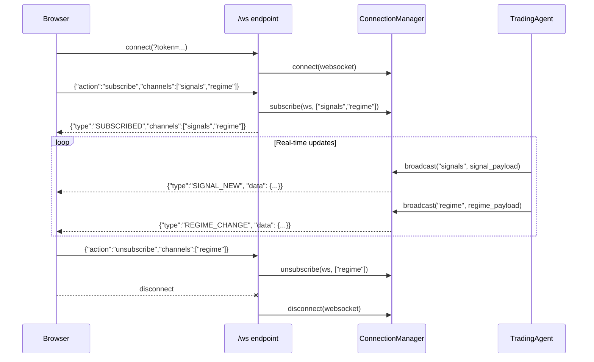
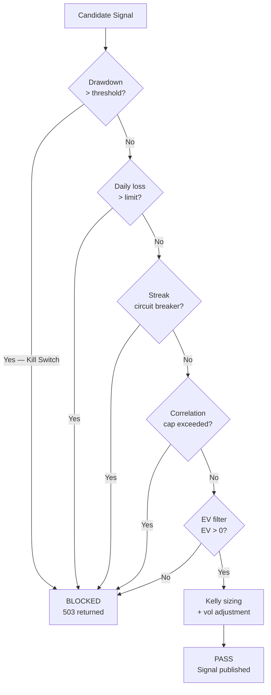
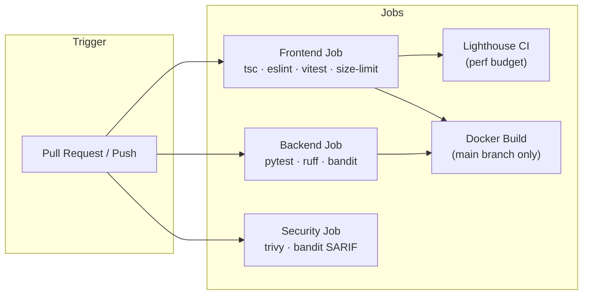

# Architecture Diagrams

> All diagrams use [Mermaid](https://mermaid.js.org/) syntax. Render in GitHub, GitLab, or the [Mermaid Live Editor](https://mermaid.live).

---

## 1. System Architecture

---

## 2. Signal Pipeline

---

## 3. Database Schema

---

## 4. Celery Task Topology

---

## 5. WebSocket Channel Model

---

## 6. Risk Engine Decision Tree

---

## 7. CI/CD Pipeline

